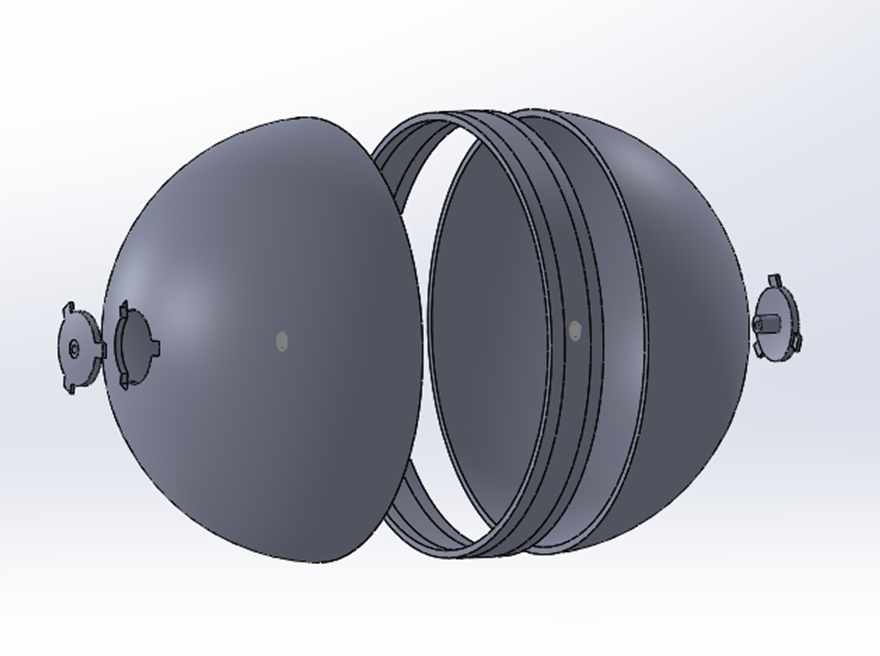
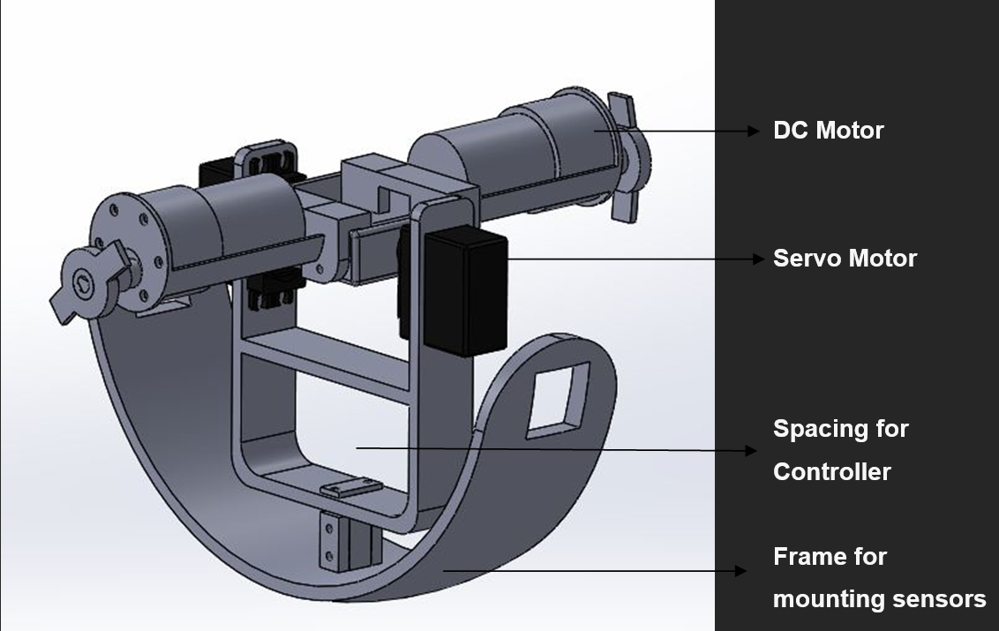
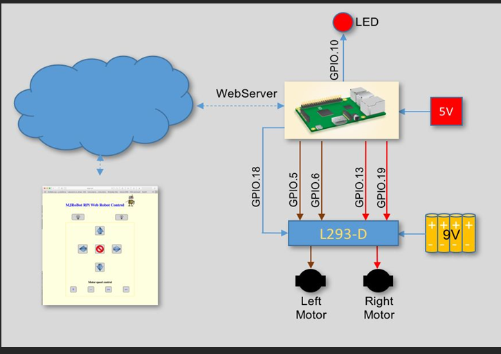
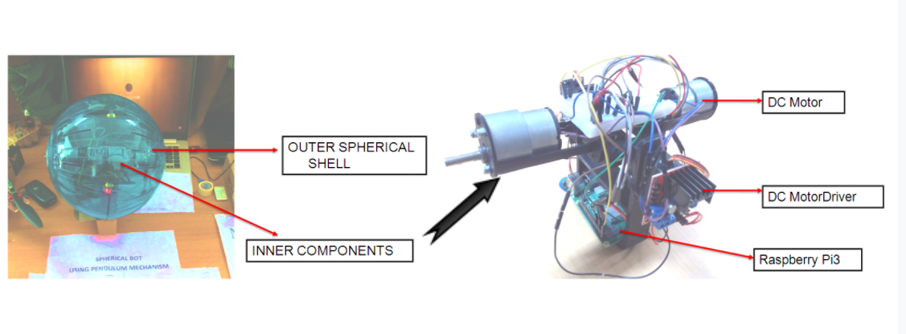

# Design-and-development-of-Spherical-Robot-using-Pendulum-Mechanism

Unlike traditional wheeled robots , this robot is designed to locomote without wheels.The main objective of such design is to transverse through uneven terrain which is rather difficult to achieve using wheels. The entire working mechanism is enclosed in a durable spherical plastic shell. This mechanism is based on the inverted pendulum mechanism, where a simple shift at the center of mass creates the required motion in the robot.

This robot has its applications in a wide range of fields.It can be used for surveillance, operating in hazardous environments and also to monitor in rough terrain.

## Robot design

1. Outer spherical enclosure

    

2. Inner inverted pendulum mechanism

    
    
3. Remote robot control solution

    
    
4. Robot prototype

    
